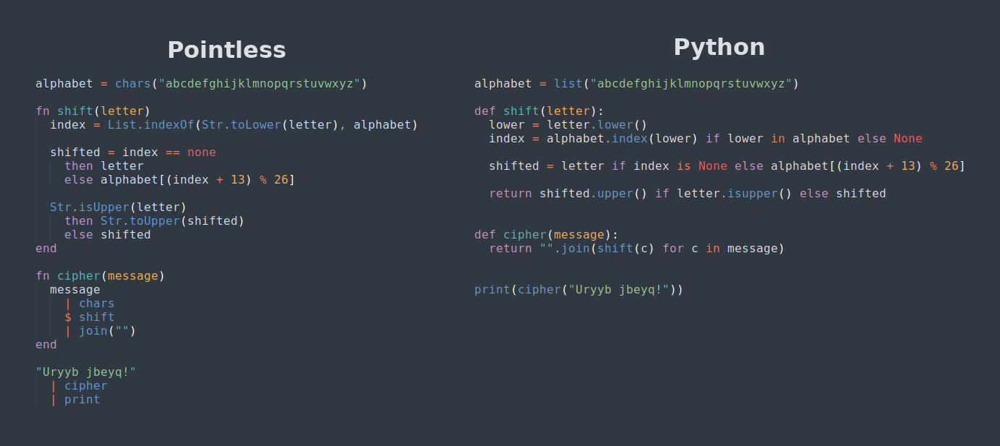

# CS1: Introduction to Programming

## Hello World!

There's an old tradition among computer programmers: when learning a new
language, we start by writing a little program that prints out the message
"Hello world!". Type out the code below and run it.

```py
print("Hello world!")
```

When you run the code, it should print out the following message.

```
Hello world!
```

Congratulations, you are now a computer programmer!

## Type out these examples!

You can't learn to play piano just by watching videos of other people playing.
At some point you've got to put your fingers on the keyboard.

Similarly, you should type the code in these examples into your editor, rather
than copying and pasting it. It's tedious, but it will better prepare you to
write your own code in the future.

## What is a Program?

A **program** is a sequence of instructions that tells a computer how to perform
a task. We call these instructions **code**. Our "hello world" program contains
a single instruction.

```py
print("Hello world!")
```

## Running Code

When we **run** a computer program, the computer goes through the instructions
in our code in order from the start of the program to the end.

What will this code display?

```py
print("Hello world!")
print("Greetings from Python")
print("Let's write some code")
```

---

This program displays the three messages in the `print` instructions, in the
order that they are written.

```
Hello world!
Greetings from Python
Let's write some code
```

## Programming Languages

In the same way that there are many spoken languages (English, Mandarin, Hindi,
etc), there are many **aprogramming languages**. Different languages have
different strengths and weaknesses.

In this course we'll be writing our programs using **Python**, a popular,
general-purpose programming language.

That being said, the concepts we'll learn will be relevant when using a wide
variety of programming languages.

## I Made a Programming Language

Different spoken languages have different vocabulary (words) and different rules
for how those words can fit together (grammar).

Similarly, different programming languages provide different instructions, and
have different rules about how those instructions can be used.

I've worked on designing a new programming language as a personal project for
many years.



## Some Programming Terminology

**Program**: a sequence of instructions that tells a computer how to perform a
task.

**Code**: the instructions in a program.

**Running** a program: having a computer follow the instructions in a program.

**Programming Language**: a way of writing code, using a specific set of
instructions and following certain rules.

**Python**: the programming language that we'll be using in this course.
